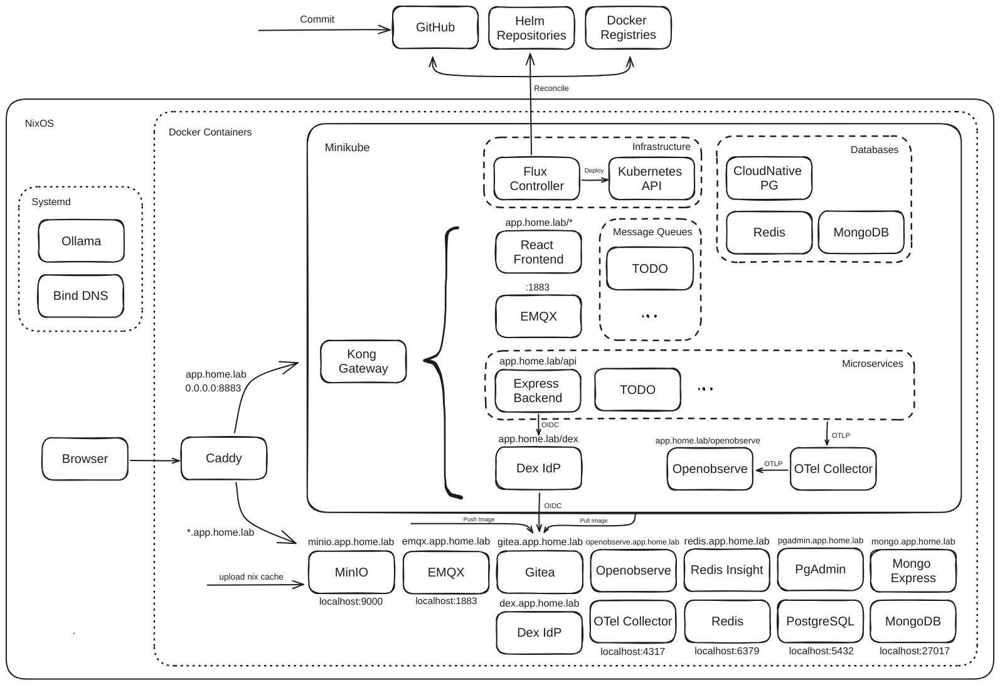

# Homedium

A homelab project to experiment with different technologies.

## Overview



The project provides a similar setup for both local development (with a few additional gui tools) and kubernetes deployment, it uses:

- [Minikube](https://minikube.sigs.k8s.io/) to run a local kubernetes cluster
- [FluxCD](https://fluxcd.io/) for GitOps-based kubernetes management
- [Terraform](https://www.terraform.io/) to bootstrap FluxCD
- [Kong](https://docs.konghq.com/gateway/latest/) as the kubernetes [Gateway API](https://gateway-api.sigs.k8s.io/)
- [SOPS](https://getsops.io/) for secrets management
- [Gitea](https://about.gitea.com/) as OIDC provider and docker registry
- [Dex](https://dexidp.io/) as OIDC provider that connects to Gitea
- [MinIO](https://min.io/) for [Nix binary cache](https://nixos.wiki/wiki/Binary_Cache)
- [Caddy](https://caddyserver.com/) as reverse proxy, including [layer4](https://caddyserver.com/docs/modules/layer4) proxy for mqtt traffic
- [Openobserve](https://openobserve.ai/) as the [OpenTelemetry](https://opentelemetry.io/) backend
- [Bind9](https://www.isc.org/bind/) for DNS
- [mkcert](https://mkcert.dev/) for self-signed certificates

## Structure

```
.
├── certs/                # self-signed certificate
├── docker/               # docker compose files for development
├── kubernetes/           # kubernetes manifests
│   ├── apps/             # applications manifests
│   ├── clusters/         # fluxcd manifests (includes vendor and environemnt)
│   ├── environments/     # gateway and config manifests (includes apps)
│   └── vendor/           # third-party services manifests
├── raspberrypi/          # raspberry pi source code
├── src/                  # source code for custom services
│   ├── backend/          # express api backend
│   └── frontend/         # react frontend
├── terraform/            # terraform manifests to bootstrap flux
├── compose.yaml          # entry point for all docker compose files
└── README.md
```
